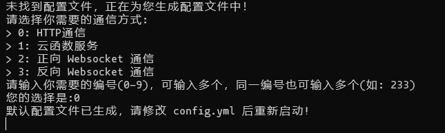
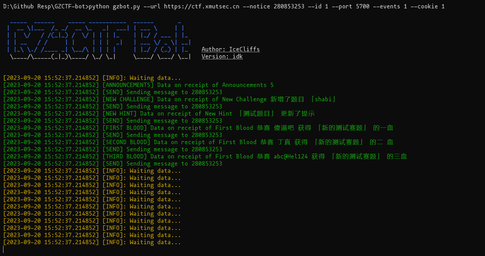

## GZCTF-bot

~~《以赛促学、以赛促教、学赛结合》~~

适用于GZ::CTF的赛事播报机器人，GZ::CTF非常牛逼，GZ大大的好！，你的代码写的真棒！.jpeg

### 特性🛠️

- 一血二血三血播报（一血、二血、三血）
- 题目动态播报
- 赛事动态播报
- 队伍作弊播报

### 部署🔨

#### 直接go-cqhttp（推荐）

> 这样做比较方便一点，开箱即用

- 到 [https://github.com/Mrs4s/go-cqhttp/releases](https://github.com/Mrs4s/go-cqhttp/releases) 下载对应的版本，在 config.yaml 填入你的QQ号和密码

```yaml
account: # 账号相关
  uin: 1145141919810 # QQ账号
  password: '' # 密码为空时使用扫码登录
  encrypt: false  # 是否开启密码加密
  status: 0      # 在线状态 请参考 https://docs.go-cqhttp.org/guide/config.html#在线状态
  relogin: # 重连设置
    delay: 3   # 首次重连延迟, 单位秒
    interval: 3   # 重连间隔
    max-times: 0  # 最大重连次数, 0为无限制
```

- 然后使用 http 进行连接即可



```yaml
# 连接服务列表
servers:
  # 添加方式，同一连接方式可添加多个，具体配置说明请查看文档
  #- http: # http 通信
  #- ws:   # 正向 Websocket
  #- ws-reverse: # 反向 Websocket
  #- pprof: #性能分析服务器

  - http: # HTTP 通信设置
      address: 0.0.0.0:5700 # HTTP监听地址
      version: 11     # OneBot协议版本, 支持 11/12
      timeout: 5      # 反向 HTTP 超时时间, 单位秒，<5 时将被忽略
      long-polling:   # 长轮询拓展
        enabled: false       # 是否开启
        max-queue-size: 2000 # 消息队列大小，0 表示不限制队列大小，谨慎使用
      middlewares:
        <<: *default # 引用默认中间件
      post:           # 反向HTTP POST地址列表
```

然后配置下脚本就行了

- 参数说明
  - --url 比赛平台 e.g: https://ctf.xmutsec.cn
  - --notice 赛事播报群 群号
  - --id 赛事ID
  - --port CQ的端口
- 以下为可选选项
  - --events 赛事详情通知群
  - --cookie 管理员Cookie，开了赛事详情通知群后配置

```bash
python gzbot.py --url="https://ctf.xmutsec.cn" --notice=280853253 --id=1 --port=5700
```
如果您成功安装了依赖，并正确的配好了参数，他将会这样子运行 :D



#### 使用 nonebot 插件

（开发ing）